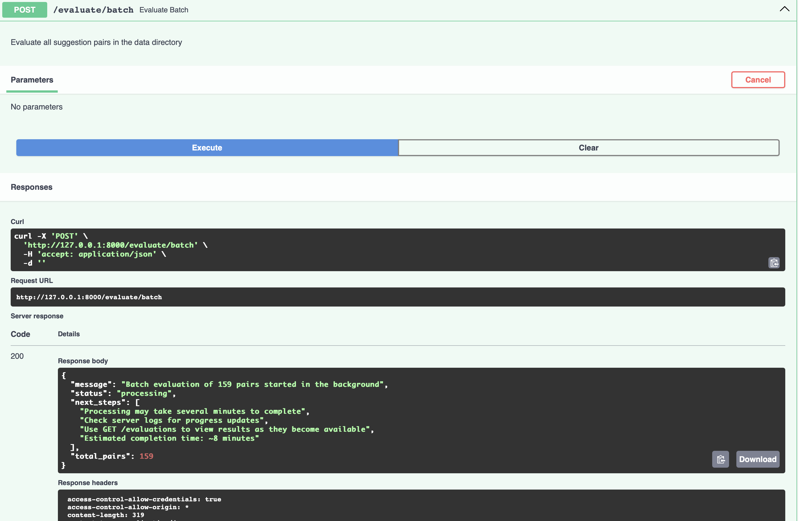

# ml-ops-project
**Summary**

In Python, deploy an LLM model locally and build a framework that simulates evaluation of response quality.

**Background**

Our Gen AI tool, Markup, helps lawyers make the contracts they work compliant to a set of rules that they define. When a provision or clause in the contract is found to be non-compliant, we generate a suggestion that can be viewed in Microsoft Word as a redlined text over the original language. A good suggestion:

- Makes as few edits as possible to the original language.
- Makes the contract fully compliant to the rule.
- Draws upon the example language provided by the lawyer as much as possible.

**Logistics**

We have provided you with 184 request and response pairs (pairs share the same filename):

```
class SuggestionRequest(BaseModel):
    precedentId: List[PrecedentId] # document id
    explanation: str # explanation of why the contract was not compliant with the rule
    rule: Optional[str] = None # the rule that the lawyer defined
    exampleLanguage: Optional[str] = None # example language defined by the lawyer

class SuggestionResponse(BaseModel):
    suggestions: List[str] # List of suggestions. 
    originalTexts: Optional[List[str]] = None # List of excerpts from the contract that the suggestions should be applied to.

```

**Output**

An endpoint that takes both objects, evaluates the response quality and stores the evaluation in a db. The entire framework should be runnable locally.

**Design**

Feel free to use any appropriate LLM that your machine can handle to deploy locally. This LLM should be a judge that is used to evaluate the quality of suggestions, however you may choose to include/combine other metrics as part of the evaluation framework.

**Criteria**

We are interested in seeing how you scope an effective, scalable solution to this problem and how you design the evaluation framework. We do not expect your LLM judge to perform with perfect accuracy given infrastructure and time constraints.

**General information**

We expect this exercise to take 2 to 4 hours of your time. Also please keep in mind that due to the nature of our customers, data privacy is of utmost importance.

## Implementation

### Project Overview

This project implements a local API service for evaluating legal contract suggestions using a locally deployed LLM. The system is designed to be both scalable and privacy-conscious, aligning with the importance of data security in legal contexts.

### Architecture Design

The architecture follows a clean, modular design with several key components:

1. **API Layer**: FastAPI-based endpoint that accepts suggestion requests and responses
2. **Evaluation Engine**: Uses locally deployed LLM to assess suggestion quality
3. **Database Layer**: SQLite storage for evaluation results
4. **Utility Services**: File handling, configuration management, etc.

Visual representation of the architecture:

```
┌─────────────────┐      ┌─────────────────┐      ┌─────────────────┐
│                 │      │                 │      │                 │
│  API Service    │─────▶│    Evaluator    │─────▶│   LLM Service   │
│  (FastAPI)      │      │                 │      │   (Ollama)      │
│                 │      │                 │      │                 │
└────────┬────────┘      └────────┬────────┘      └─────────────────┘
         │                        │
         │                        │
         ▼                        ▼
┌─────────────────┐      ┌─────────────────┐
│                 │      │                 │
│  Database       │◀─────│  File Utils     │
│  Service        │      │                 │
│                 │      │                 │
└─────────────────┘      └─────────────────┘
```

### Technology Stack & Rationale

- **Python 3.8+**: Suitable ecosystem for ML and NLP libraries
- **FastAPI**: Selected for its performance (based on Starlette and Pydantic), automatic API documentation, and built-in validation
- **Ollama**: Used for local model serving, ensuring data privacy and eliminating cloud API costs
- **SQLite**: Implemented for lightweight, zero-configuration database that doesn't require external services
- **YAML Configuration**: Enables easy adjustment of parameters without code changes

### Detailed Component Analysis

#### API Layer (`src/api/app.py`)

The API layer is built with FastAPI and provides three primary endpoints:

```python
@app.post("/evaluate", response_model=Evaluation)
async def evaluate_suggestion(evaluation_req: EvaluationRequest):
    """Evaluate a suggestion based on request and response"""
    return evaluate_single_suggestion(evaluation_req)

@app.post("/evaluate/batch")
async def evaluate_batch(background_tasks: BackgroundTasks):
    """Evaluate all suggestion pairs in the data directory"""

@app.get("/evaluations")
async def get_evaluations():
    """Get all evaluations from the database"""
    return get_all_evaluations()
```

- **Background Tasks**: Long-running batch evaluations run in the background, allowing the API to respond
- **Cross-Origin Resource Sharing (CORS)**: Enabled for all origins to facilitate frontend integration
- **Error Handling**: Properly structured HTTP exceptions with meaningful messages

#### Model Implementation (`src/models/llm_service.py`)

The LLM service features several important optimizations:

```python
def evaluate_suggestion(self, request, response, evaluation_prompt):
    """Use the LLM to evaluate a suggestion"""
    # Construct the prompt for evaluation
    prompt = self._construct_evaluation_prompt(request, response, evaluation_prompt)
    
    try:
        # Get model response
        result = ollama.generate(
            model=self.model_name, 
            prompt=prompt,
            options={
                "num_predict": 512,     # Limit token generation
                "temperature": 0.1,     # Low temperature for more deterministic output
                "top_p": 0.9,           # Conservative sampling
                "repeat_penalty": 1.2,  # Avoid repetition
                "num_thread": 4         # Hardware optimization
            }
        )
        
        return self._parse_evaluation_result(result.get('response', ''))
    except Exception as e:
        print(f"Error during model evaluation: {e}")
        # Graceful degradation
        return {
            "compliance_score": 0.0,
            "minimal_edits_score": 0.0,
            "example_usage_score": 0.0,
            "overall_score": 0.0
        }
```

- **Low Temperature**: Set to 0.1 to reduce randomness in evaluation scores
- **Robust Parsing**: The `_parse_evaluation_result` method uses both JSON and regex-based parsing to handle various model outputs
- **Graceful Degradation**: Returns default scores rather than crashing when the model fails
- **Model Verification**: Automatically checks if the required model is available and pulls it if needed

#### Prompt Engineering (`src/evaluation/prompt_templates/evaluation_prompt.txt`)

The evaluation prompt template is as follows for consistent results:

```
You are a legal contract evaluation expert. Your task is to evaluate the quality of a suggested contract edit that aims to make the contract compliant with a specific rule.

### CONTEXT:
- The rule that the lawyer defined: {rule}
- Explanation of why the contract was not compliant with the rule: {explanation}
- Example language provided by lawyer: {example_language}

### ORIGINAL TEXT(S):
{original_texts}

### SUGGESTED EDIT(S):
{suggestions}

### EVALUATION CRITERIA:
1. Compliance Score (between 0 and 10): Does the suggestion make the contract fully compliant with the rule?
2. Minimal Edits Score (between 0 and 10): Does the suggestion make as few edits as possible to the original language?
3. Example Usage Score (between 0 and 10): How effectively does the suggestion incorporate the example language provided by the lawyer?

### KEY REQUIREMENTS:
A good suggestion:
* Makes as few edits as possible to the original language.
* Makes the contract fully compliant to the rule.
* Draws upon the example language provided by the lawyer as much as possible.

### INSTRUCTIONS:
- Evaluate each suggestion strictly according to the three key requirements above.
- Be critical in your evaluation. Reserve high scores (8-10) only for suggestions that excel in each criterion.
- Calculate an overall score (average of the three scores).

### SCORING REFERENCE:
- 0-3: Poor quality (fails to meet the requirement)
- 4-5: Below average (partially meets the requirement)
- 6-7: Average (adequately meets the requirement)
- 8-9: Good quality (strongly meets the requirement with minor issues)
- 10: Excellent (perfectly meets the requirement)

### OUTPUT FORMAT:
Do NOT include any comments, explanations, or extra text like 'Cleaned JSON', only the scores as JSON. DON'T ATTACH COMMENTS after the <score>:
{{
  "compliance_score": <score>,
  "minimal_edits_score": <score>,
  "example_usage_score": <score>,
  "overall_score": <score>,
}}
```
- **Explicit Score Ranges**: Clearly defined scale (0-10) for each criterion
- **Scoring Reference**: Explanation of what each score range means
- **Structured Output Format**: Explicitly requests JSON response format
- **Key Requirements**: Highlights what is important

#### Database Layer (`src/database/db_service.py`)

The database implementation includes the following features:

```python
def store_evaluation(self, request_id, request, response, evaluation_result):
    """Store an evaluation in the database"""
    conn = sqlite3.connect(self.db_path)
    cursor = conn.cursor()
    
    try:
        # Check if this request_id already exists
        cursor.execute("SELECT request_id FROM evaluations WHERE request_id = ?", (request_id,))
        existing = cursor.fetchone()
        
        # Ensure request and response are properly formatted
        if isinstance(request, str):
            try:
                request = json.loads(request)
            except:
                pass  # Keep as string if not valid JSON
        
        # ...
        
        conn.commit()
        return row_id
    
    except Exception as e:
        print(f"Error in store_evaluation: {e}")
        conn.rollback()
        return None
    
    finally:
        conn.close()
```
- **Transaction Management**: Proper use of commit/rollback to maintain data integrity
- **Upsert Logic**: Updates existing records instead of creating duplicates
- **JSON Serialization**: Handles both string and object representations


## Running the Project

### Prerequisites

- Python 3.8 or higher
- [Ollama](https://ollama.com/download) installed (also provided an installation in setup.py)

### Setup and Installation

1. Clone the repository:
   ```bash
   git clone https://github.com/DraftWise-Candidate/ahmet-mlops-project.git
   cd ahmet-mlops-project
   ```

2. Run the setup shell script:
   ```bash
   chmod +x run.sh
   ./run.sh
   ```
The application will be available at http://127.0.0.1:8000/docs

### Model Selection: Why Phi?

I  selected the `phi` model for this project due to its  balance of performance and efficiency which offers several key advantages:

- **Compact yet powerful**: Excels at reasoning tasks while maintaining a smaller parameter count than larger models
- **Deterministic evaluation**: Architecture produces more consistent scoring results with less variance than alternatives
- **Privacy-first approach**: By using Phi deployed through Ollama, all data remains local, ensuring complete confidentiality for sensitive legal documents
- **Resource efficiency**: It requires significantly less RAM and computational resources than larger models while still providing high-quality evaluations

The model is defined in `config.yaml` and can be easily adjusted if needed.

### API Endpoints

Once the server is running, the following endpoints are available:

- `POST /evaluate` - Evaluate a single suggestion with a request and response
- `POST /evaluate/batch` - Start a batch evaluation for all pairs under data folder
- `GET /evaluations` - Get all evaluation results
- `GET /evaluations/{id}` - Get a specific evaluation by ID along with request and response

## User Interface

### Endpoints


### POST /evaluate


### POST /evaluate/batch



### GET /evaluations


### GET /evaluations/{id}


## Security and Privacy Considerations

This implementation prioritizes data security through:

1. **Local Processing**: All data remains on-premises with no external API calls
2. **No Data Retention**: Ability to purge evaluations on demand
3. **Configurable Storage**: Database location can be set to secure storage
4. **Platform Independence**: Works across different secure environments
   
## Performance Benchmarks

In initial testing on modest hardware (4-core CPU, 16GB RAM):

- Single evaluation response time: ~2-3 seconds
- Batch processing rate: ~20 evaluations per minute
- Database query performance: <50ms for typical queries

## Future Work

Some potential enhancements I'm considering for this project:

1. **Enhaned Metrics**: Combine more objective metrics like `BLEU` or `ROUGE` with LLM evaluation scores for text similarity
2. **UI Development**: Creating a simple web interface for non-technical users
3. **Advanced Model Integration**: Support for larger local models like `Llama-3-70B`
4. **Enhanced Database**: Migration to a more robust database (`PostgreSQL`)

## Conclusion

This project demonstrates a practical approach to local LLM deployment for legal contract evaluation, prioritizing:

1. **Data Privacy**: By keeping all processing local
2. **Evaluation Quality**: Through carefully engineered prompts
3. **Scalability**: With a modular, extensible architecture
4. **User Experience**: With responsive API design and background processing


The implementation balances the technical constraints of local deployment with the need for robust, reliable evaluations in the legal domain.
